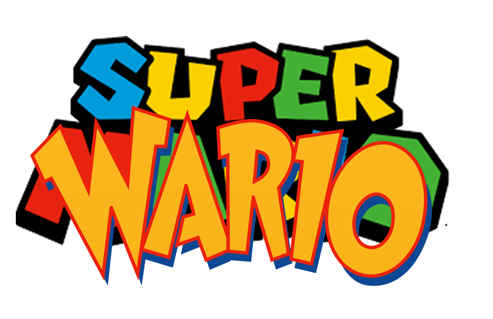

# Super Wario

 
## Descrição
**Super Wario** é um jogo desenvolvido em **Assembly para a arquitetura MIPS**, inspirado no clássico **Super Mario Bros**, da Nintendo. Criado como parte da disciplina de **Arquitetura de Computadores**, ministrada pelo professor **Eduardo Bráulio**, o projeto propõe uma nova perspectiva ao universo do jogo original.

No jogo, os papéis foram invertidos: o protagonista é **Wario**, enquanto os inimigos são os **Toads**, e o grande vilão final é ninguém menos que o próprio **Mario**. O jogo conta com **três níveis**.

---

## Ferramentas Utilizadas
- **MARS 4.5**: Simulador para a execução de código Assembly MIPS.  
- **Bitmap Display**: Responsável pela renderização dos elementos gráficos do jogo em uma tela de 512x256, utilizando uma unidade gráfica de 4x4 pixels.  
- **Keyboard and Display MMIO Simulator**: Ferramenta usada para interação com o teclado e exibição de informações em tempo real.
---
## Tutorial de como jogar
1. **Baixe o Simulador**
   - Acesse a pasta [Tools](Tools) e baixe o simulador **Mars45**.

2. **Baixe o Arquivo do Jogo**
   - Baixe o arquivo [Wario](Wario-vfinal.asm).

3. **Abra o Simulador**
   - Inicie o simulador **Mars45** e carregue o arquivo **Wario**.

4. **Ative as Ferramentas Necessárias**
   - No canto superior direito, clique em **Tools**.
   - Ative as ferramentas **Bitmap Display** e **Keyboard and Display MMIO Simulator** e conecte-as.

5. **Configure o Bitmap Display**
   - Configure seu **Bitmap Display** da seguinte maneira:
   

6. **Divirta-se!**
   - Agora é só rodar o jogo e se divertir!

## Dicas Adicionais
- Certifique-se de que as ferramentas estejam ativadas corretamente para evitar problemas durante o jogo.
- Se algo não funcionar como esperado, reinicie o simulador e verifique as configurações novamente.
---
## Contribuidores
- [Ícaro Gabriel](https://github.com/icarolindogostoso)  
- [Flávio Matias](https://github.com/FlavioMatias)
- [Francisco "Xico" Gabriel]()
  
## Artes feitas por:
- [Davi Feron]()
- [Guilherme Fagundes]()

## Agradecimentos
- [Ana Maria](https://github.com/namariaa)
- [Prof. Eduardo Braulio]()
- [GP da Russia]()
- [Jesus Cristo](https://img.freepik.com/fotos-premium/jesus-cristo-como-programador-da-vida-ilustracao-legal-estilo-comico_67778-154.jpg?semt=ais_hybrid)
